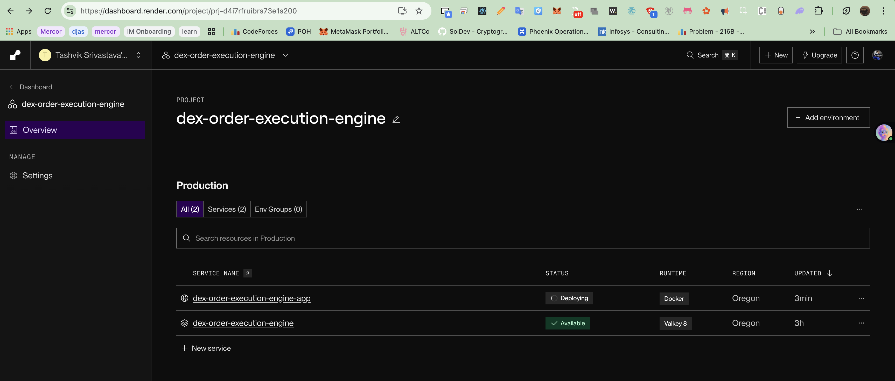

Solana Order Execution Engine (Backend Task)

A high-performance backend system designed to execute Market Orders across Raydium and Meteora on Solana. It features intelligent DEX routing, concurrent queue processing, and real-time WebSocket status updates.

🚀 Quick Start

Prerequisites

Docker & Docker Compose
Node.js (v18+)

Installation

Clone & Install
    npm install

Start Infrastructure (Redis & Postgres)
    docker-compose up -d

Run the Engine
    npm run dev

🏗 Architecture

    Design Decisions
    Order Type: Market Order
    Why? Market orders are the atomic unit of trading. Limit orders (price trigger) and Sniper orders (liquidity trigger) essentially become market orders once their conditions are met. Building a robust Market Order engine provides the foundation for all other types.

    Extensibility: To add Limit Orders, we would simply add a "Price Watcher" service that monitors the price feed and pushes a job to the OrderQueue only when the target price is hit. Similarly, Sniper orders can be implemented by adding a liquidity watcher. 
        The architecture for Sniper orders would be like :
            Is the pool open? No. Wait and Watch. As soon as InitializePool transaction appears -> Fire Swap immediately.

    Tech Stack
    Fastify: Chosen for low overhead and built-in WebSocket support.
    BullMQ (Redis): Handles concurrency (10 concurrent jobs) and rate limiting (100/min) with robust retry logic (exponential backoff).
    Mock DEX Router: Simulates network latency (200-500ms) and price slippage to mimic real-world Solana conditions.

    System Flow

POST /api/orders/execute: Accepts payload { tokenIn, tokenOut, amount }. Returns orderId.
WS /api/orders/:id/status: Client connects to stream updates.

Queue: Job added to Redis. Worker picks it up.

Routing: System queries Mock Raydium/Meteora.
Execution: System "submits" tx and waits for confirmation.
Update: WebSocket emits pending -> routing -> submitted -> confirmed.

🧪 Testing

API Endpoints 
-------------

1. Submit Order
    curl --location 'https://dex-order-execution-engine-app.onrender.com/api/orders/execute' \
--header 'Content-Type: application/json' \
--data '{"tokenIn": "SOL", "tokenOut": "SOL", "amount": 1}'

2. Get Order Status via Websocket
    https://dex-order-execution-engine-app.onrender.com/api/orders/145a142c-c74c-46fa-a6c5-d21a0dd5a212/status

2. WebSocket Response Example
    Sample message from WebSocket:
    {
        "orderId": "145a142c-c74c-46fa-a6c5-d21a0dd5a212",
        "status": "pending",
        "message": "Connection established. Waiting for order execution..."
    }

Render Deployment

